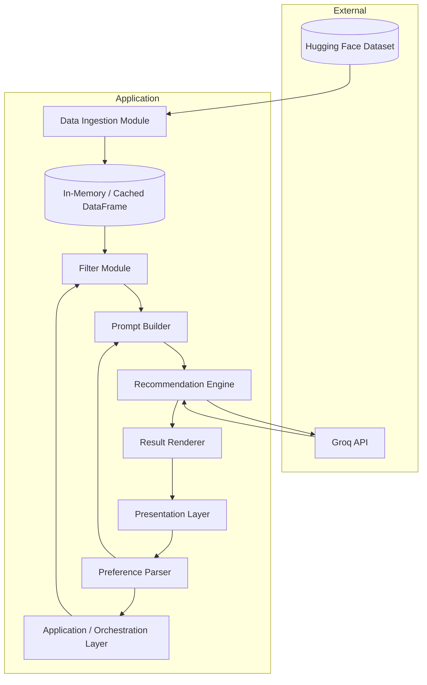
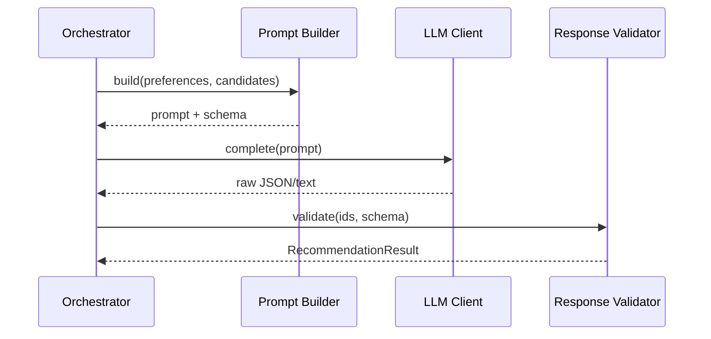
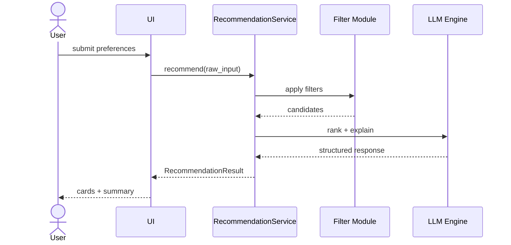
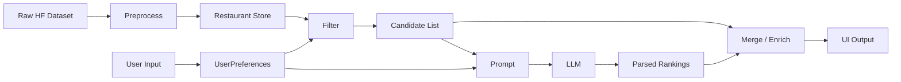

# Architecture: AI-Powered Restaurant Recommendation System

This document describes the technical architecture for the Zomato-inspired restaurant recommendation service defined in [context.md](./context.md). The design combines deterministic data filtering with LLM-based ranking and natural-language explanations.

---

## 1. Architectural Goals

| Goal | Description |
|------|-------------|
| **Relevance** | Recommendations align with location, budget, cuisine, rating, and optional constraints |
| **Transparency** | Each suggestion includes a human-readable rationale tied to user preferences |
| **Groundedness** | LLM output is constrained to provided restaurant records—no invented fields |
| **Simplicity** | Clear separation of ingestion, filtering, prompting, and presentation |
| **Extensibility** | Swappable LLM provider, UI, and dataset without rewriting core logic |

---

## 2. System Context

```mermaid
C4Context
    title System Context
    Person(user, "End User", "Seeks restaurant recommendations")
    System(app, "Recommendation App", "Filters data and uses LLM for ranked suggestions")
    System_Ext(hf, "Hugging Face", "Zomato restaurant dataset")
    System_Ext(llm, "Groq API", "LLM for ranking and explanations")

    user --> app : preferences + views results
    app --> hf : load dataset
    app --> llm : prompt with candidates + preferences
```

**Actors**

- **End user** — submits preferences and reads recommendations
- **Hugging Face** — hosts `ManikaSaini/zomato-restaurant-recommendation`
- **Groq** — LLM provider that ranks candidates and generates explanations

---

## 3. High-Level Architecture

The system follows a **pipeline architecture**: structured data is narrowed deterministically, then the LLM performs semantic ranking and explanation on a bounded candidate set.



### Layer Responsibilities

| Layer | Responsibility |
|-------|----------------|
| **Presentation** | Collect preferences; display ranked cards with explanations |
| **Orchestration** | Coordinate request lifecycle, errors, and timeouts |
| **Data** | Load, preprocess, cache restaurant records |
| **Filtering** | Apply hard constraints before LLM (location, rating, budget, cuisine) |
| **Integration** | Build prompts; call LLM; parse structured responses |
| **Rendering** | Map LLM output + source records into display DTOs |

---

## 4. Component Design

### 4.1 Data Ingestion Module

**Purpose:** Load the Zomato dataset once (or on schedule), normalize schema, and expose a queryable in-memory store.

**Responsibilities**

- Download dataset via `datasets` (Hugging Face) or equivalent loader
- Map raw columns to canonical field names
- Clean missing values, normalize location/cuisine strings, coerce numeric types
- Derive budget tier from cost if not present in source data
- Persist only columns needed for filtering and prompting

**Canonical schema (target)**

| Field | Type | Notes |
|-------|------|-------|
| `id` | string | Stable identifier (generated if absent) |
| `name` | string | Restaurant name |
| `location` | string | City / area; normalized for case-insensitive match |
| `cuisines` | list[string] | Split multi-value cuisine strings |
| `cost_for_two` | number | INR or dataset-native currency |
| `budget_tier` | enum | `low` \| `medium` \| `high` (derived or mapped) |
| `rating` | float | Aggregate rating |
| `raw_metadata` | object | Optional extra fields for prompt context |

**Preprocessing rules (examples)**

- Trim and lowercase location for matching; preserve display casing separately
- Split `"Italian, Chinese"` → `["Italian", "Chinese"]`
- Map cost ranges to budget tiers (configurable thresholds in `config`)

**Outputs**

- `RestaurantRepository` interface: `get_all()`, `filter(predicate)`, `get_by_ids(ids)`

---

### 4.2 Preference Parser

**Purpose:** Validate and normalize user input into a typed `UserPreferences` object.

**Input (user-facing)**

| Field | Required | Validation |
|-------|----------|------------|
| `location` | yes | Select box containing unique locations from the dataset |
| `budget` | yes | One of `low`, `medium`, `high` |
| `cuisine` | yes | Non-empty; supports single or multiple |
| `min_rating` | yes | Float in [0, 5] |
| `additional_preferences` | no | Free text (e.g., "family-friendly", "quick service") |

**Output: `UserPreferences`**

```json
{
  "location": "Bangalore",
  "budget": "medium",
  "cuisines": ["Italian"],
  "min_rating": 4.0,
  "additional_notes": "family-friendly, quick service"
}
```

**Behavior**

- Reject invalid enums with clear error messages
- Normalize cuisine synonyms optionally (e.g., "North Indian" → canonical label)
- Pass `additional_notes` verbatim to the prompt builder as soft constraints

---

### 4.3 Filter Module (Deterministic Pre-LLM)

**Purpose:** Reduce the full dataset to a **bounded candidate set** (e.g., 10–30 restaurants) using hard filters. This controls token cost, latency, and hallucination risk.

**Filter pipeline (order matters)**

1. **Location** — exact or contains match on normalized `location`
2. **Minimum rating** — `rating >= min_rating`
3. **Cuisine** — intersection with user `cuisines` (any-match or all-match configurable)
4. **Budget** — `budget_tier == user.budget` or cost within tier band
5. **Top-K by rating** — if candidates exceed `MAX_CANDIDATES`, keep highest-rated

**Fallback strategy**

| Condition | Action |
|-----------|--------|
| Zero matches after all hard filters | Relax cuisine OR budget (config flag); surface message to user |
| Still zero | Return empty state; do not call LLM |
| Too many matches | Sort by rating desc, truncate to `MAX_CANDIDATES` |

**Output**

- `List<RestaurantCandidate>` — structured records passed to prompt builder
- `FilterMetadata` — counts, relaxed constraints, warnings for UI

---

### 4.4 Prompt Builder (Integration Layer)

**Purpose:** Assemble a grounded prompt that includes user preferences and only the filtered restaurant JSON.

**Prompt structure**

```
[System]
You are a restaurant recommendation assistant. Rank ONLY from the provided
restaurant list. Do not invent restaurants or attributes. If data is missing,
say "not available". Return valid JSON matching the output schema.

[User preferences]
{serialized UserPreferences}

[Restaurant candidates]
{JSON array of candidates, max N items}

[Task]
1. Rank top K restaurants (K={top_k}) for the user.
2. For each, explain why it fits their preferences (1-2 sentences).
3. Optionally provide a one-sentence summary of the shortlist.
```

**Design choices**

- **Structured output** — request JSON schema (provider-native JSON mode or tool calling)
- **Grounding** — include restaurant `id` in output; merge explanations with source records server-side
- **Soft constraints** — `additional_notes` influence ranking but do not exclude candidates unless LLM is instructed to deprioritize

---

### 4.5 Recommendation Engine (Groq LLM Client)

**Purpose:** Invoke Groq, parse response, validate against candidate IDs, and produce `RecommendationResult`.

**Groq integration**

- Use the official `groq` Python SDK behind the `LLMClient` abstraction.
- Authenticate with `GROQ_API_KEY` (or `LLM_API_KEY` when `LLM_PROVIDER=groq`).
- Default model: `llama-3.3-70b-versatile` (configurable via `LLM_MODEL`).
- Request structured JSON output; Groq supports JSON-mode responses for schema-constrained ranking.
- The client remains swappable—other providers can be added later without changing filter or UI layers.

**Sequence**



**Response schema (expected from LLM)**

```json
{
  "summary": "Three strong Italian options in Bangalore under medium budget.",
  "recommendations": [
    {
      "restaurant_id": "abc123",
      "rank": 1,
      "explanation": "Matches your Italian preference with 4.5 rating and medium cost."
    }
  ]
}
```

**Post-processing**

- Drop recommendations whose `restaurant_id` is not in the candidate set
- Enrich each item with `name`, `cuisine`, `rating`, `cost` from repository
- If LLM returns fewer than `top_k`, fill from remaining candidates by rating (optional fallback)

**Resilience**

| Failure | Handling |
|---------|----------|
| API timeout | Retry once; then fallback to rating-sorted list without AI explanations |
| Invalid JSON | Retry with repair prompt; else deterministic ranking only |
| Hallucinated ID | Strip invalid entries; log for monitoring |

---

### 4.6 Result Renderer / Presentation Layer

**Purpose:** Present `RecommendationResult` in a user-friendly format.

**Display model: `RecommendationCard`**

| Field | Source |
|-------|--------|
| Restaurant name | Repository |
| Cuisine | Repository |
| Rating | Repository |
| Estimated cost | Repository (`cost_for_two` or tier label) |
| Rank | LLM |
| AI explanation | LLM |
| Optional summary | LLM (shown once above list) |

**UI options (choose one for implementation)**

| Option | Pros | Cons |
|--------|------|------|
| **CLI** | Fastest to build; good for demos | Limited UX |
| **Streamlit / Gradio** | Rapid prototyping, forms + cards | Less customizable |
| **Web app (React + API)** | Production-like UX | More components |

Architecture supports any option via a thin adapter implementing `RecommendationPresenter`.

---

## 5. Application Orchestration

A single **RecommendationService** coordinates the end-to-end flow:

```
recommend(preferences) ->
  1. parse(preferences) -> UserPreferences
  2. candidates = filter(repository, user_prefs)
  3. if candidates.empty -> return EmptyResult
  4. prompt = prompt_builder.build(user_prefs, candidates)
  5. llm_response = engine.complete(prompt)
  6. result = validator.merge(llm_response, repository)
  7. return presenter.format(result)
```



---

## 6. Data Flow Diagram



---

## 7. Configuration

Centralize environment-driven settings:

| Key | Description | Example |
|-----|-------------|---------|
| `HF_DATASET_ID` | Hugging Face dataset path | `ManikaSaini/zomato-restaurant-recommendation` |
| `LLM_PROVIDER` | Provider identifier | `groq` |
| `LLM_MODEL` | Groq model name | `llama-3.3-70b-versatile` |
| `GROQ_API_KEY` | Groq API secret (env only) | — |
| `LLM_API_KEY` | Optional alias for provider key | — |
| `MAX_CANDIDATES` | Max restaurants sent to LLM | `20` |
| `TOP_K` | Recommendations returned | `5` |
| `BUDGET_THRESHOLDS` | Cost → tier mapping | JSON config |
| `FILTER_RELAX_ON_EMPTY` | Relax cuisine/budget if no hits | `true` |

---

## 8. Suggested Project Structure

```
zomato/
├── docs/
│   ├── context.md
│   ├── problemStatement.txt
│   └── architecture.md
├── src/
│   ├── config.py                 # Settings from env
│   ├── models/
│   │   ├── restaurant.py         # Restaurant, RestaurantCandidate
│   │   ├── preferences.py        # UserPreferences
│   │   └── recommendation.py     # RecommendationResult, Card
│   ├── data/
│   │   ├── loader.py             # Hugging Face ingestion
│   │   ├── preprocessor.py       # Normalize schema
│   │   └── repository.py         # In-memory access
│   ├── services/
│   │   ├── filter.py             # Deterministic filtering
│   │   ├── prompt_builder.py     # Prompt templates
│   │   ├── llm_client.py         # Provider abstraction
│   │   ├── recommendation_engine.py
│   │   └── recommendation_service.py  # Orchestrator
│   ├── presentation/
│   │   ├── cli.py                # Optional CLI entry
│   │   └── streamlit_app.py      # Optional UI entry
│   └── main.py
├── tests/
│   ├── test_filter.py
│   ├── test_prompt_builder.py
│   └── test_recommendation_service.py
├── requirements.txt
└── .env.example
```

---

## 9. Technology Stack (Recommended)

| Concern | Technology | Rationale |
|---------|------------|-----------|
| Language | Python 3.10+ | Strong HF / LLM ecosystem |
| Dataset | `datasets`, `pandas` | Native Hugging Face loading |
| LLM | `groq` Python SDK | Fast inference; primary provider for MVP and Phase 4 UI |
| UI (MVP) | Streamlit or CLI | Fast demo aligned with problem statement |
| Config | `pydantic-settings` | Typed env validation |
| Testing | `pytest` | Unit tests for filter and parser |

---

## 10. Security and Operations

**Secrets**

- Store `GROQ_API_KEY` in environment variables only; never commit `.env`
- Ship `.env.example` with placeholder keys

**Data privacy**

- Dataset is public; no PII expected—still avoid logging full user sessions in production

**Observability (optional enhancements)**

- Log filter counts, LLM latency, token usage, validation failures
- Structured logs for debugging prompt/response mismatches

**Cost control**

- Cap `MAX_CANDIDATES` and use smaller models for MVP
- Cache dataset in memory after first load

---

## 11. Non-Functional Requirements

| Attribute | Target |
|-----------|--------|
| **Latency** | End-to-end < 10s for MVP (dominated by LLM) |
| **Availability** | Graceful degradation if LLM unavailable |
| **Correctness** | All displayed fields traceable to dataset or explicit LLM explanation text |
| **Maintainability** | LLM provider behind interface; prompts versioned in code or templates |

---

## 12. Testing Strategy

| Layer | Test focus |
|-------|------------|
| **Preprocessor** | Column mapping, budget tier derivation |
| **Filter** | Hard constraints, relax fallback, top-K truncation |
| **Prompt builder** | Snapshot of prompt shape; no API key required |
| **LLM client** | Mock responses; schema validation |
| **Integration** | Golden-path with fixture dataset and stubbed LLM |
| **E2E (manual)** | Real API key + sample user preferences |

---

## 13. Evolution Path

Phases beyond MVP (not required for initial delivery):

1. **Persistent cache** — SQLite/Parquet for faster cold starts
2. **Embedding retrieval** — semantic search for `additional_preferences` before LLM
3. **Feedback loop** — thumbs up/down to refine future prompts
4. **REST API** — decouple UI from core service for mobile/web clients
5. **Multi-turn chat** — conversational refinement of preferences

---

## 14. Traceability to Context

| Context requirement | Architectural element |
|---------------------|------------------------|
| Hugging Face dataset | Data Ingestion Module + `RestaurantRepository` |
| User preferences | Preference Parser → `UserPreferences` |
| Filter before LLM | Filter Module |
| Prompt with structured data | Prompt Builder |
| Rank + explain | Recommendation Engine |
| Display name, cuisine, rating, cost, explanation | Result Renderer + `RecommendationCard` |
| No hallucinated fields | Grounded prompt + response validation by `restaurant_id` |
| Personalized, transparent output | LLM explanations merged with source records |

---

## 15. Summary

The architecture uses a **two-stage recommendation pipeline**: deterministic filtering on structured Zomato data narrows candidates, then an LLM ranks and explains choices within that grounded set. Clear module boundaries (ingestion, parsing, filtering, prompting, LLM, presentation) keep the system testable, swappable, and aligned with the goals in [context.md](./context.md).
