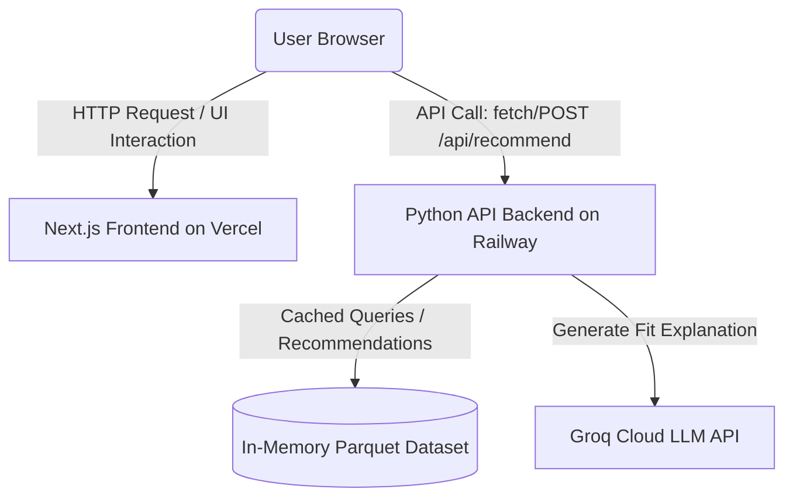

# Deployment Plan: Zomato AI Restaurant Recommendations

This document outlines the step-by-step plan to deploy the **Zomato AI Restaurant Recommendations** application as a decoupled web app, with the **Python JSON API backend** deployed on **Railway** and the **Next.js frontend** deployed on **Vercel**.

---

## 📋 Deployment Metadata

| Component | Technology | Target Host | Main Entry Point | Primary Environment Config |
| :--- | :--- | :--- | :--- | :--- |
| **Frontend** | Next.js (TypeScript/React) | **Vercel** | `frontend/` (Root Directory) | `NEXT_PUBLIC_API_URL` |
| **Backend** | Python 3.10 HTTP API Server | **Railway** | `src/presentation/api.py` | `GROQ_API_KEY`, `PORT` |
| **Database/Data** | In-Memory Dataset (Parquet) | Railway Container | `data/restaurant.parquet` | - |
| **LLM Provider** | Groq API (`llama-3.3-70b-versatile`) | Groq Serverless | API Requests | `GROQ_API_KEY` |

---

## 🌐 Architecture Overview

Below is the execution flow of the decoupled deployment model:



---

## ⚙️ Backend Deployment: Railway

Railway is a cloud platform that allows you to provision infrastructure, build from a `Dockerfile`, and deploy apps automatically from your GitHub repository.

### Step 1: Push Local Updates to GitHub
Make sure all your latest files, including the updated root [Dockerfile](file:///c:/Users/patil/Downloads/zomato/zomato/Dockerfile) and [src/presentation/api.py](file:///c:/Users/patil/Downloads/zomato/zomato/src/presentation/api.py), are committed and pushed to your remote repository:
```bash
git add .
git commit -m "Configure api.py and Dockerfile for Railway backend deployment"
git push origin main
```

### Step 2: Configure Railway Service
1. Log in to [Railway.app](https://railway.app).
2. Click **"New Project"** -> **"Deploy from GitHub repo"**.
3. Select your `zomato` repository.
4. Railway will automatically detect the root `Dockerfile` and start a container build.

### Step 3: Add Backend Environment Variables
In the Railway dashboard, navigate to the **Variables** tab for the service and add the following variables:

| Variable Name | Value / Description | Required / Optional |
| :--- | :--- | :--- |
| `GROQ_API_KEY` | `gsk_your_actual_groq_api_key_here` | **Required** (For AI explanations) |
| `PORT` | `8000` (Railway will overwrite this automatically with a dynamic port) | **Required** (Handled dynamically) |
| `LLM_PROVIDER` | `groq` | Optional |
| `LLM_MODEL` | `llama-3.3-70b-versatile` | Optional |

> [!IMPORTANT]
> The backend [src/presentation/api.py](file:///c:/Users/patil/Downloads/zomato/zomato/src/presentation/api.py) is preconfigured to bind to `0.0.0.0` and read the `PORT` env variable. Exposing `0.0.0.0` is essential for Railway to route external internet requests to the container.

### Step 4: Expose the Railway Public URL
1. Go to your service's **Settings** tab.
2. Under **Networking**, click **"Generate Domain"** (or configure a custom domain).
3. Save the generated URL (e.g., `https://zomato-production.up.railway.app`). This is the backend API URL you will pass to Vercel.

---

## 🎨 Frontend Deployment: Vercel

Vercel is the native hosting platform for Next.js applications. It compiles static and dynamic pages with serverless optimizations.

### Step 1: Configure Vercel Project
1. Log in to [Vercel.com](https://vercel.com).
2. Click **"Add New..."** -> **"Project"**.
3. Import your `zomato` repository.
4. On the **Configure Project** screen, set the following critical settings:
   * **Framework Preset:** `Next.js`
   * **Root Directory:** Click **Edit** and select the `frontend` subdirectory (since the Next.js app sits inside `frontend/`).

### Step 2: Set Environment Variables
In the **Environment Variables** section on Vercel, add the following key:

* **Key:** `NEXT_PUBLIC_API_URL`
* **Value:** The Railway backend URL generated in Step 4 above (e.g., `https://zomato-production.up.railway.app`).
* *Note: Make sure to exclude a trailing slash (use `...railway.app` instead of `...railway.app/`).*

### Step 3: Build & Deploy
Click **"Deploy"**. Vercel will:
1. Navigate into the `frontend/` directory.
2. Install Node.js dependencies (`package.json`).
3. Compile and build the Next.js production bundle.
4. Spin up your frontend app on a custom Vercel URL (e.g., `https://zomato-frontend.vercel.app`).

---

## 🔒 CORS Configuration Details

To prevent cross-origin issues between your frontend (`vercel.app`) and backend (`railway.app`), CORS headers are fully integrated inside the backend server [src/presentation/api.py](file:///c:/Users/patil/Downloads/zomato/zomato/src/presentation/api.py):

* **OPTIONS preflight checks** are intercepted and responded to with:
  ```python
  self.send_header("Access-Control-Allow-Origin", "*")
  self.send_header("Access-Control-Allow-Methods", "POST, OPTIONS, GET")
  self.send_header("Access-Control-Allow-Headers", "Content-Type")
  ```
* **GET and POST payloads** are sent back with `Access-Control-Allow-Origin: *` headers, ensuring modern browsers do not block recommendations.

---

## 🛠️ Post-Deployment Verification

After both platforms complete their deployments, execute these smoke checks:

1. **Test Frontend Landing Page:**
   * Navigate to the Vercel app URL.
   * Verify the UI displays correctly, background glow animations are functional, and the preprocessed restaurant list loads.
2. **Retrieve Locations (GET):**
   * Inspect the network logs in your browser.
   * Ensure that `GET /api/locations` returns the location array (e.g., `["Indiranagar", "BTM", ...]`) successfully.
3. **Submit Recommendation Form (POST):**
   * Change filters (e.g., select `Indiranagar`, enter `Italian`, specify `romantic rooftop`).
   * Click **"Generate"**.
   * Verify that recommendations are successfully fetched from Railway, LLM explanations are visible, and the application loads in under 2 seconds.

---

## ⚠️ Troubleshooting

### 1. `Fetch failed / NetworkError` in Frontend
* **Cause:** The `NEXT_PUBLIC_API_URL` variable was not configured correctly on Vercel, or is pointing to `localhost`.
* **Fix:** Go to Vercel -> Project Settings -> Environment Variables, verify `NEXT_PUBLIC_API_URL` contains the valid `https` Railway address, and trigger a redeployment.

### 2. `Connection Refused` on Railway Backend
* **Cause:** The Python server failed to bind to `0.0.0.0` or did not pick up the `$PORT` environment variable.
* **Fix:** Confirm your backend [Dockerfile](file:///c:/Users/patil/Downloads/zomato/zomato/Dockerfile) CMD is set to run `python src/presentation/api.py` and that the code reads `os.getenv("PORT")` correctly.

### 3. Rate-Limiting or Groq API Failures
* **Cause:** Missing or invalid `GROQ_API_KEY` on Railway.
* **Fix:** Double check the Railway **Variables** tab, enter a valid key, and check service logs for standard fallback messages indicating rating-based sorting.
